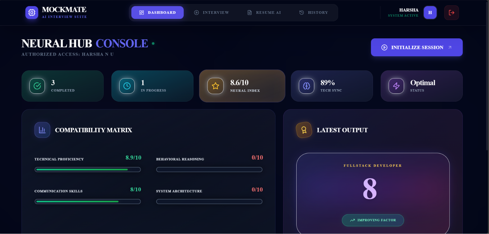
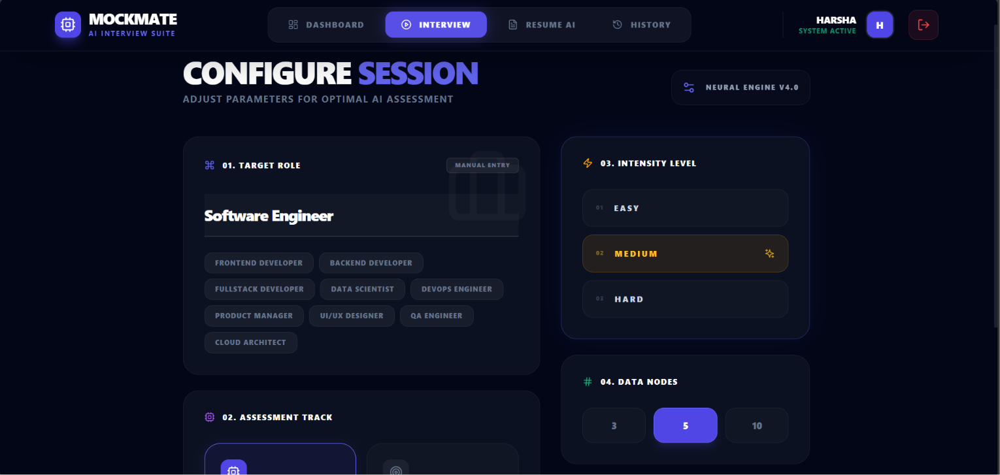

<p align="center">
  
</p><div align="center">


# 💻 MockMate – AI Mock Interview Platform (Frontend)

Modern React frontend for an AI-powered Mock Interview Platform.


</div>

---

# 📖 Project Overview

MockMate is an AI-powered mock interview platform designed to help users prepare for technical interviews. The platform enables users to practice interview questions, receive AI-generated feedback, analyze resumes, and monitor their interview performance through a modern web interface.

# 🚀 Project Highlights

- 🤖 AI-powered interview question generation
- 📄 Resume analysis
- 🔐 Secure JWT authentication
- 📊 Interview performance dashboard
- 💬 AI-generated answer evaluation
- 📱 Responsive modern interface
- ⚡ RESTful API architecture
- 🗄️ MongoDB database integration
  
# ✨ Features

- User Authentication
- Responsive Dashboard
- Resume Upload
- AI Mock Interview
- Interview Result Page
- Profile Management
- Modern UI
- Responsive Design

---

# 🛠️ Tech Stack

## Frontend
- React.js
- Vite
- JavaScript
- Tailwind CSS
- Axios

---

# 📂 Folder Structure

<pre> # 🏗️ Project Architecture ```text User │ ▼ React Frontend │ REST API Calls │ ▼ Spring Boot Backend │ JWT Authentication │ ▼ MongoDB │ ▼ Groq AI API ``` </pre>

# ⚙️ Installation

```bash
git clone https://github.com/harshagowda2409-bit/MockMate-your-interview-partner-frontend.git

cd MockMate-your-interview-partner-frontend

npm install

npm run dev
```

---

# 📷 Application Screens

- Home
- Login
- Dashboard
- Interview Session
- AI Feedback
- Profile

---

# 🚀 Future Improvements

- Dark Mode
- Voice Interview
- Coding Interview Module
- Mobile Responsive Improvements
- AI Career Guidance

---
# 📸 Screenshots

## login Page


---

## Dashboard



---

## Interview



---

## AI history


# ⚙️ Backend Repository

https://github.com/harshagowda2409-bit/MockMate-your-interview-partner

---

## 👨‍💻 Developer

**Harsha N U**

Information Science & Engineering

AMC Engineering College
